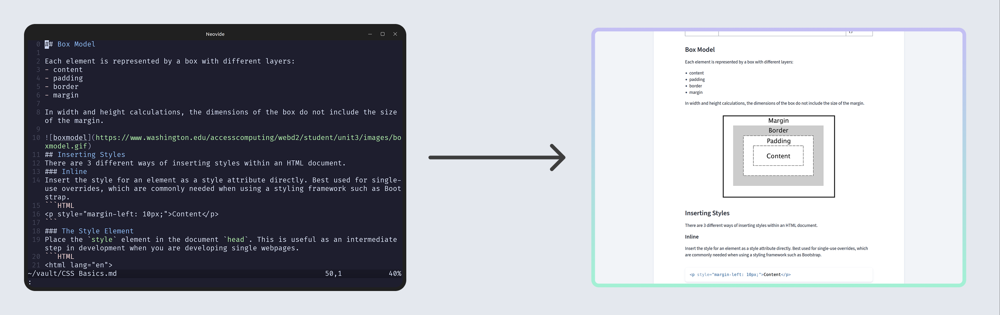

# Convert Markdown to a Website

This is my implementation of a website generator that takes in Markdown files from my Obsidian vault.



## Installation

1. Install Python 3.10 or greater.
2. Install pandoc: https://pandoc.org/installing.html.
3. Install requirements:
    ```sh
    pip install -r requirements.txt
    ```
4. Create `settings.yaml` based on instructions from `settings.yaml.example`.

## Usage

1. Run `build.py` to create HTML files from the Markdown files in the directory specified in `settings.yaml`. 
2. Copy `publish` to your server.
3. Set up Nginx with a configuration similar to the one shown in `nginx_server.example`. See how to set up an Nginx server here: https://ubuntu.com/tutorials/install-and-configure-nginx
4. Access the index of your site via the origin of the server!

## Todo
- Add support for callouts with different types (`[!note]` vs. `[!important]`, for example)
- Add support for vault attachments
- Add a search box element that can be optionally included in the index